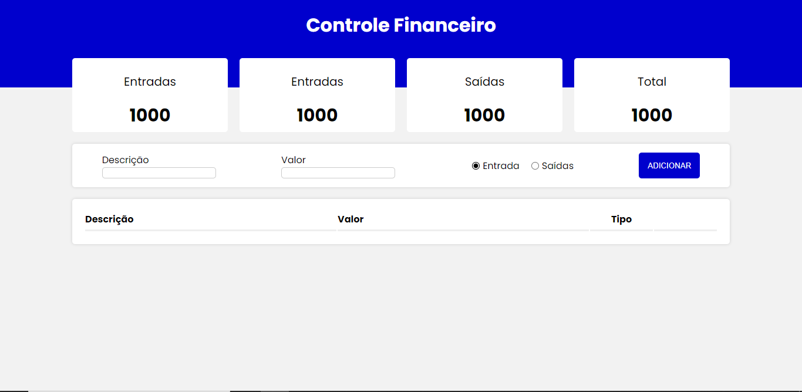

# Controle Financeiro

---

#### capa do projeto

#### Sobre :pencil:

A finalidade do projeto é ter um controle de entradas e saídas no fluxo financeiro de uma pessoa.
Atenção o projeto é só um "rascunho" então está com vários erros de tipagem e de syntax.

#### Próximos passos :rocket:
Comecei o projeto apenas para praticar mais, mas eu tenho algumas ideias para aprimorar o projeto:

- [ ] 1. Resolver os problemas de tipagem.
- [ ] 2. Tema Dark/light.
- [ ] 3. Fazer a versão mobile e responsividade.
- [ ] 4. Registro de investimentos.
- [ ] 5. importação automática da carteira de investimentos.
- [ ] 6. Criar um CRUD em python.
- [ ] 7. Criar o banco de dados.

- [ ] 8. Fazer o deploy da aplicação.
- [ ] Ter mais ideias para aprimorar o projeto.